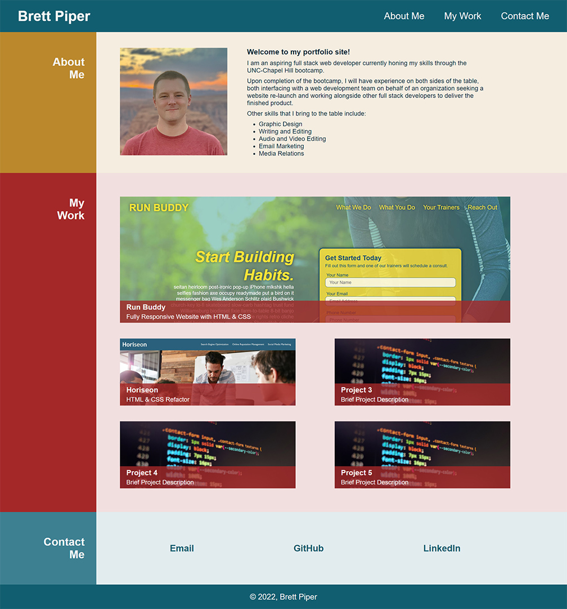

# Portfolio

*screenshot of the portfolio*

## The Challenge

I was asked to build a responsive portfolio webpage to allow a prospective employer to sample my previous work. Specific requirements included a photo and bio, as well as previous projects and contact information, all of which adapts to the viewport window size.

## Contact

Brett Piper - <bpiper91@gmail.com>